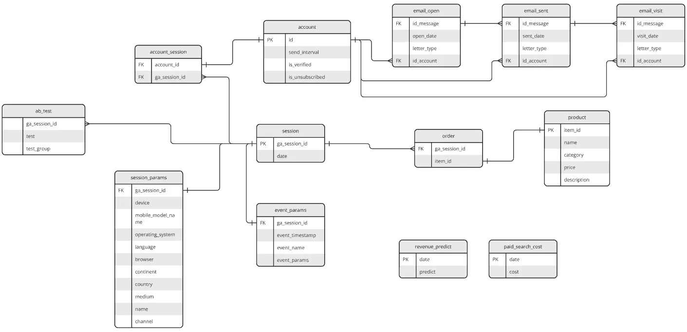

# E-commerce-SQL-Practice-Project

## Overview

This repository contains several independent SQL analytical queries built on a shared e-commerce database.

The goal of this project is to practice:

- Data aggregation

- JOIN operations

- Window functions

- CTE usage

- Working with nested data

- Revenue and marketing analysis

All queries are written in BigQuery SQL.

## Database Schema



### The database includes:

Core transactional tables

- `order`

- `product`

Session & event data
  
- `session`

- `session_params`

- `event_params`

Marketing & forecasting

- `paid_search_cost`

- `revenue_predict`

## Query 1 – Revenue by Continent
[Query 1 – Revenue by Continent](query1.sql)
### Task

For each continent:

- Calculate total revenue

- Calculate revenue from Bookcases & shelving units

- Compute the percentage share of this category

### What this query demonstrates

- Multiple table joins

- Conditional aggregation

- Percentage calculation

- Grouping and sorting

## Query 2 – Monthly Marketing Cost Share
[Query 2 – Monthly Marketing Cost Share](query2.sql)
### Task

Calculate the percentage of monthly paid search costs relative to total costs across the whole period.

### What this query demonstrates

- Date extraction (EXTRACT)

- Aggregation by month and year

- Window functions (SUM() OVER())

- Analytical percentage calculation

## Query 3 – Session Engagement Rate by Device
[Query 3 – Session Engagement Rate by Device](query3.sql)
### Task

Calculate the percentage of events where session_engaged = 1 out of all events where this value is not NULL, grouped by device.

### What this query demonstrates

- CTE usage

-  with nested fields (UNNEST)

- Conditional counting

- Behavioral analysis by device

## Query 4 – Cumulative Revenue vs Target
[Query 4 – Cumulative Revenue vs Target](query4.sql)
### Task

Calculate cumulative actual revenue vs cumulative predicted revenue by date and compute the percentage of target achievement.

### What this query demonstrates

- UNION ALL

- Cumulative sums with window functions

- Revenue progress tracking

- Combining real and forecasted data

## Skills Practiced

- SQL joins

- Aggregations

- Window functions

- CTEs

- UNION operations

- Working with nested data

- Basic business metrics calculation

## How to Use

1. Run the queries in BigQuery.

2. Each query is independent and can be executed separately.

3. The schema image should be uploaded to the repository root (e.g., schema.png) and referenced in this README.

## Project Structure

```
e-commerce-sql-practice-project/

  README.md
  query1.sql
  query2.sql
  query3.sql
  query4.sql
  schema.png
```
